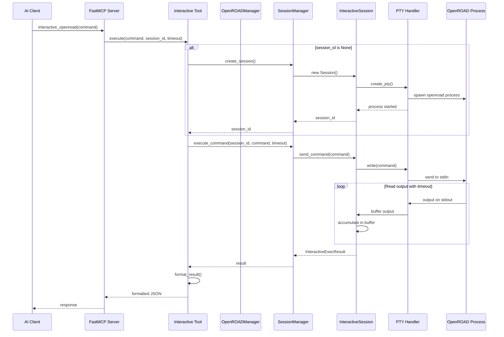

# OpenROAD MCP Architecture

## Overview

OpenROAD MCP is a Model Context Protocol (MCP) server that provides AI assistants with access to OpenROAD chip design and timing analysis tools through a structured, async API. The system manages multiple concurrent interactive sessions with PTY (pseudo-terminal) support for true terminal emulation.

## Data Flow Diagram

## Key Design Patterns

### 1. Singleton Pattern
**OpenROADManager** uses singleton pattern to ensure single subprocess management instance across the application.

### 2. Factory Pattern
**OpenROADManager** acts as a factory for creating and managing InteractiveSession instances.

### 3. Strategy Pattern
**PTYHandler** encapsulates the PTY management strategy, allowing different terminal handling approaches.

### 4. Observer Pattern
Background threads in PTYHandler observe stdout/stderr and notify the session through queues.

### 5. Template Method Pattern
**BaseTool** provides template for tool execution with `_format_result()` and `execute()` methods.

### 6. Lazy Initialization
Interactive session manager is only created when first accessed through the property.
