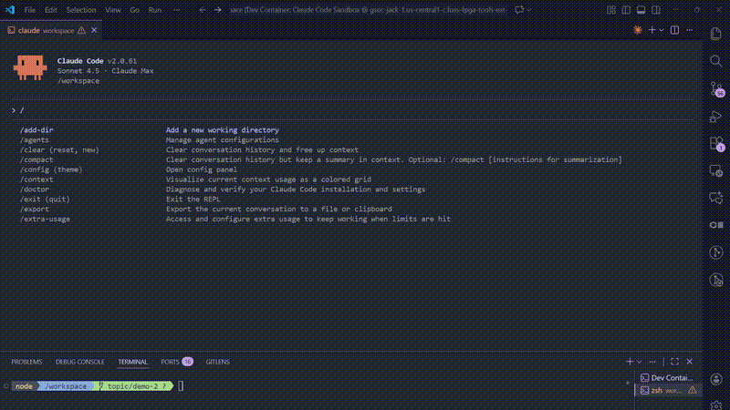

# OpenROAD MCP Server

<!-- mcp-name: io.github.luarss/openroad-mcp -->

A Model Context Protocol (MCP) server that provides tools for interacting with OpenROAD and ORFS (OpenROAD Flow Scripts).

## Demo



[Watch full demo video](https://youtu.be/UQM1otOl17s)

## Features

- **Interactive OpenROAD sessions** - Execute commands in persistent OpenROAD sessions with PTY support
- **Session management** - Create, list, inspect, and terminate multiple sessions
- **Command history** - Access full command history for any session
- **Performance metrics** - Get comprehensive metrics across all sessions
- **Report visualization** - List and read report images from ORFS runs

## Requirements

- **OpenROAD** installed and available in your PATH
  - [Installation guide](https://openroad.readthedocs.io/en/latest/main/GettingStarted.html)
- **OpenROAD-flow-scripts (ORFS)** for complete RTL-to-GDS flows (optional but recommended)
  - [ORFS installation guide](https://openroad-flow-scripts.readthedocs.io/)
- **Python 3.13+** or higher
- **uv** package manager
  - Install: `curl -LsSf https://astral.sh/uv/install.sh | sh`

## Support Matrix

| MCP Client | Supported | Transport Mode(s) | Config file |
|------------|--------|------------------|-------------|
| Claude Code | ✅ | STDIO | `.claude/settings.json` |
| Claude Desktop | ✅ | STDIO | `~/Library/Application Support/Claude/claude_desktop_config.json` (macOS) |
| Cursor | ✅ | STDIO | `.cursor/mcp.json` |
| GitHub Copilot (VS Code) | ✅ | STDIO | `.vscode/mcp.json` |
| Gemini CLI | ✅ | STDIO | `~/.gemini/settings.json` |
| Windsurf | ✅ | STDIO | `~/.codeium/windsurf/mcp_config.json` |
| Cline | ✅ | STDIO | VS Code globalStorage (see below) |
| Roo Code | ✅ | STDIO | `.roo/mcp.json` |
| Continue | ✅ | STDIO | `~/.continue/config.json` |
| Zed | ✅ | STDIO | `~/.config/zed/settings.json` |
| JetBrains AI Assistant | ✅ | STDIO | Settings UI |
| Amazon Q Developer CLI | ✅ | STDIO | `~/.aws/amazonq/mcp.json` |
| Augment Code | ✅ | STDIO | VS Code `settings.json` |
| Warp | ✅ | STDIO | Settings UI |
| Amp | ✅ | STDIO | CLI-managed |
| Trae | ✅ | STDIO | User config |
| Opencode | ✅ | STDIO | `opencode.json` |
| Kiro | ✅ | STDIO | Settings UI |
| Kilo Code | ✅ | STDIO | `.kilocode/mcp.json` |
| Goose | ✅ | STDIO | `~/.config/goose/config.yaml` |
| Sourcegraph Cody | ✅ | STDIO | VS Code `settings.json` |
| OpenAI Codex CLI | ✅ | STDIO | `~/.codex/config.toml` |
| PearAI | ✅ | STDIO | `~/pearai/config.json` |
| CodeBuddy | ✅ | STDIO | `~/.codebuddy/config.jsonc` |
| Hermes Agent | ✅ | STDIO | `~/.hermes/config.yaml` |
| GitHub Copilot CLI | ✅ | STDIO | `~/.copilot/mcp-config.json` |
| Oh My Pi | ✅ | STDIO | `.omp/mcp.json` |
| OpenClaw | ✅ | STDIO | `~/.openclaw/openclaw.json` |
| AstrBot | ✅ | STDIO | WebUI |
| DeepCode | ✅ | STDIO | `deepcode_config.json` |
| nanobot | ✅ | STDIO | `nanobot.yaml` |
| Crush | ✅ | STDIO | `.crush.json` |
| Reasonix | ✅ | STDIO | `reasonix.toml` |
| Other MCP clients | ⚠️ | STDIO | Should work with standard STDIO transport |

## Getting Started

**New to OpenROAD MCP?** Check out our [Quick Start guide](QUICKSTART.md).

For platform-specific setup instructions, see the [Cross-Platform Guide](docs/CROSS_PLATFORM.md).

### Standard Configuration

The basic configuration for all MCP clients:

```json
{
  "mcpServers": {
    "openroad-mcp": {
      "command": "uvx",
      "args": [
        "--from",
        "git+https://github.com/luarss/openroad-mcp@v0.5.2",
        "openroad-mcp"
      ]
    }
  }
}
```

> **Note:** The URL above is pinned to a specific release for supply chain safety.
> To always track the latest version instead, drop the `@v0.5.2` suffix:
> `"git+https://github.com/luarss/openroad-mcp"`.

For local development, use:

```json
{
  "mcpServers": {
    "openroad-mcp": {
      "command": "uv",
      "args": [
        "--directory",
        "/path/to/openroad-mcp",
        "run",
        "openroad-mcp"
      ]
    }
  }
}
```

## Installation

<details>
<summary><b>Claude Code</b></summary>

```bash
claude mcp add --transport stdio openroad-mcp -- uvx --from git+https://github.com/luarss/openroad-mcp openroad-mcp
```

Or add the [standard configuration](#standard-configuration) to `.claude/settings.json`.

</details>

<details>
<summary><b>Claude Desktop</b></summary>

Add the [standard configuration](#standard-configuration) to:
- **macOS**: `~/Library/Application Support/Claude/claude_desktop_config.json`
- **Windows**: `%APPDATA%\Claude\claude_desktop_config.json`

</details>

<details>
<summary><b>Cursor</b></summary>

Add the [standard configuration](#standard-configuration) to `.cursor/mcp.json`.

</details>

<details>
<summary><b>GitHub Copilot (VS Code)</b></summary>

Add to `.vscode/mcp.json` (VS Code 1.99+). Note the different schema — `servers` key and `"type": "stdio"` required:

```json
{
  "servers": {
    "openroad-mcp": {
      "type": "stdio",
      "command": "uvx",
      "args": [
        "--from",
        "git+https://github.com/luarss/openroad-mcp@v0.5.2",
        "openroad-mcp"
      ]
    }
  }
}
```

</details>

<details>
<summary><b>Gemini CLI</b></summary>

Follow the [Gemini MCP install guide](https://ai.google.dev/gemini-api/docs/model-context-protocol), using the [standard configuration](#standard-configuration) above.

</details>

<details>
<summary><b>Windsurf</b></summary>

Add the [standard configuration](#standard-configuration) to `~/.codeium/windsurf/mcp_config.json`.

</details>

<details>
<summary><b>Cline</b></summary>

Add to the Cline MCP settings file:
- **macOS**: `~/Library/Application Support/Code/User/globalStorage/saoudrizwan.claude-dev/settings/cline_mcp_settings.json`
- **Windows**: `%APPDATA%\Code\User\globalStorage\saoudrizwan.claude-dev\settings\cline_mcp_settings.json`
- **Linux**: `~/.config/Code/User/globalStorage/saoudrizwan.claude-dev/settings/cline_mcp_settings.json`

```json
{
  "mcpServers": {
    "openroad-mcp": {
      "command": "uvx",
      "args": [
        "--from",
        "git+https://github.com/luarss/openroad-mcp@v0.5.2",
        "openroad-mcp"
      ],
      "disabled": false,
      "autoApprove": []
    }
  }
}
```

</details>

<details>
<summary><b>Roo Code</b></summary>

Add to `.roo/mcp.json` in your project root (or the equivalent user-level settings file via the Roo Code UI):

```json
{
  "mcpServers": {
    "openroad-mcp": {
      "command": "uvx",
      "args": [
        "--from",
        "git+https://github.com/luarss/openroad-mcp@v0.5.2",
        "openroad-mcp"
      ],
      "disabled": false,
      "autoApprove": []
    }
  }
}
```

</details>

<details>
<summary><b>Continue</b></summary>

Add to `~/.continue/config.json`:

```json
{
  "experimental": {
    "modelContextProtocolServers": [
      {
        "transport": {
          "type": "stdio",
          "command": "uvx",
          "args": [
            "--from",
            "git+https://github.com/luarss/openroad-mcp@v0.5.2",
            "openroad-mcp"
          ]
        }
      }
    ]
  }
}
```

</details>

<details>
<summary><b>Zed</b></summary>

Add to `~/.config/zed/settings.json`:

```json
{
  "context_servers": {
    "openroad-mcp": {
      "command": {
        "path": "uvx",
        "args": [
          "--from",
          "git+https://github.com/luarss/openroad-mcp@v0.5.2",
          "openroad-mcp"
        ]
      },
      "settings": {}
    }
  }
}
```

</details>

<details>
<summary><b>JetBrains AI Assistant</b></summary>

Open **Settings → Tools → AI Assistant → Model Context Protocol (MCP)** and add a new server entry using the [standard configuration](#standard-configuration).

</details>

<details>
<summary><b>Amazon Q Developer CLI</b></summary>

Add the [standard configuration](#standard-configuration) to `~/.aws/amazonq/mcp.json`.

</details>

<details>
<summary><b>Augment Code</b></summary>

Add to your VS Code `settings.json` (User or Workspace scope):

```json
{
  "augment.advanced": {
    "mcpServers": [
      {
        "name": "openroad-mcp",
        "command": "uvx",
        "args": [
          "--from",
          "git+https://github.com/luarss/openroad-mcp@v0.5.2",
          "openroad-mcp"
        ]
      }
    ]
  }
}
```

</details>

<details>
<summary><b>Warp</b></summary>

Open **Settings → AI → MCP Servers → Add New MCP Server** and enter:
- **Name**: `openroad-mcp`
- **Command**: `uvx`
- **Args**: `--from git+https://github.com/luarss/openroad-mcp openroad-mcp`

</details>

<details>
<summary><b>Amp</b></summary>

```bash
amp mcp add openroad-mcp uvx --from git+https://github.com/luarss/openroad-mcp openroad-mcp
```

</details>

<details>
<summary><b>Trae</b></summary>

Add the [standard configuration](#standard-configuration) to the MCP section of Trae's user settings (accessible via **Settings → MCP**).

</details>

<details>
<summary><b>Opencode</b></summary>

Add to `opencode.json` in your project root:

```json
{
  "mcp": {
    "openroad-mcp": {
      "type": "local",
      "command": [
        "uvx",
        "--from",
        "git+https://github.com/luarss/openroad-mcp@v0.5.2",
        "openroad-mcp"
      ],
      "enabled": true
    }
  }
}
```

</details>

<details>
<summary><b>Kiro</b></summary>

Open the MCP configuration panel in Kiro and add a new server entry using the [standard configuration](#standard-configuration).

</details>

<details>
<summary><b>Kilo Code</b></summary>

Add to `.kilocode/mcp.json` in your project root:

```json
{
  "mcpServers": {
    "openroad-mcp": {
      "command": "uvx",
      "args": [
        "--from",
        "git+https://github.com/luarss/openroad-mcp@v0.5.2",
        "openroad-mcp"
      ],
      "alwaysAllow": [],
      "disabled": false
    }
  }
}
```

</details>

<details>
<summary><b>Goose</b></summary>

Add to `~/.config/goose/config.yaml`:

```yaml
extensions:
  openroad-mcp:
    name: openroad-mcp
    type: stdio
    cmd: uvx
    args:
      - --from
      - git+https://github.com/luarss/openroad-mcp@v0.5.2
      - openroad-mcp
    enabled: true
```

</details>

<details>
<summary><b>Sourcegraph Cody</b></summary>

Add to your VS Code `settings.json`:

```json
{
  "openctx.providers": {
    "https://openctx.org/npm/@openctx/provider-mcp": {
      "transports": [
        {
          "type": "stdio",
          "command": "uvx",
          "args": [
            "--from",
            "git+https://github.com/luarss/openroad-mcp@v0.5.2",
            "openroad-mcp"
          ]
        }
      ]
    }
  }
}
```

</details>

<details>
<summary><b>OpenAI Codex CLI</b></summary>

Add to `~/.codex/config.toml` (global) or `.codex/config.toml` (project-scoped):

```toml
[[mcp_servers]]
name = "openroad-mcp"
command = "uvx"
args = ["--from", "git+https://github.com/luarss/openroad-mcp@v0.5.2", "openroad-mcp"]
```

</details>

<details>
<summary><b>PearAI</b></summary>

PearAI uses the same config format as Continue. Add to `~/pearai/config.json`:

```json
{
  "experimental": {
    "modelContextProtocolServers": [
      {
        "transport": {
          "type": "stdio",
          "command": "uvx",
          "args": [
            "--from",
            "git+https://github.com/luarss/openroad-mcp@v0.5.2",
            "openroad-mcp"
          ]
        }
      }
    ]
  }
}
```

</details>

<details>
<summary><b>CodeBuddy</b></summary>

Add to `~/.codebuddy/config.jsonc` (global) or `.codebuddy/mcp.jsonc` (project-scoped):

```jsonc
{
  "mcpServers": {
    "openroad-mcp": {
      "command": "uvx",
      "args": [
        "--from",
        "git+https://github.com/luarss/openroad-mcp@v0.5.2",
        "openroad-mcp"
      ]
    }
  }
}
```

</details>

<details>
<summary><b>Hermes Agent</b></summary>

Add to `~/.hermes/config.yaml`:

```yaml
mcp_servers:
  - name: openroad-mcp
    transport: stdio
    command: uvx
    args:
      - --from
      - git+https://github.com/luarss/openroad-mcp@v0.5.2
      - openroad-mcp
```

</details>

<details>
<summary><b>GitHub Copilot CLI</b></summary>

Add to `~/.copilot/mcp-config.json`:

```json
{
  "mcpServers": {
    "openroad-mcp": {
      "type": "stdio",
      "command": "uvx",
      "args": [
        "--from",
        "git+https://github.com/luarss/openroad-mcp@v0.5.2",
        "openroad-mcp"
      ]
    }
  }
}
```

Or run `/mcp add` inside a Copilot CLI session for guided setup.

</details>

<details>
<summary><b>Oh My Pi</b></summary>

Add to `.omp/mcp.json` (project-level) or `~/.omp/agent/mcp.json` (global):

```json
{
  "mcpServers": {
    "openroad-mcp": {
      "type": "stdio",
      "command": "uvx",
      "args": [
        "--from",
        "git+https://github.com/luarss/openroad-mcp@v0.5.2",
        "openroad-mcp"
      ]
    }
  }
}
```

</details>

<details>
<summary><b>OpenClaw</b></summary>

Add to `~/.openclaw/openclaw.json`:

```json
{
  "mcp": {
    "servers": {
      "openroad-mcp": {
        "command": "uvx",
        "args": [
          "--from",
          "git+https://github.com/luarss/openroad-mcp@v0.5.2",
          "openroad-mcp"
        ],
        "enabled": true
      }
    }
  }
}
```

Or run `openclaw mcp add` for guided setup.

</details>

<details>
<summary><b>AstrBot</b></summary>

Navigate to the AstrBot WebUI → **MCP** section → **Add Server**, and enter:

```json
{
  "command": "uvx",
  "args": ["--from", "git+https://github.com/luarss/openroad-mcp@v0.5.2", "openroad-mcp"]
}
```

Requires `uv` installed on the host running AstrBot.

</details>

<details>
<summary><b>DeepCode</b></summary>

Add to `deepcode_config.json` in your project root:

```json
{
  "tools": {
    "mcpServers": {
      "openroad-mcp": {
        "type": "stdio",
        "command": "uvx",
        "args": [
          "--from",
          "git+https://github.com/luarss/openroad-mcp@v0.5.2",
          "openroad-mcp"
        ]
      }
    }
  }
}
```

</details>

<details>
<summary><b>nanobot</b></summary>

Add to `nanobot.yaml` in your project root:

```yaml
mcpServers:
  openroad-mcp:
    command: uvx
    args:
      - --from
      - git+https://github.com/luarss/openroad-mcp@v0.5.2
      - openroad-mcp
```

</details>

<details>
<summary><b>Crush</b></summary>

Add to `.crush.json` (project-local) or `~/.config/crush/crush.json` (global):

```json
{
  "mcp": {
    "openroad-mcp": {
      "type": "stdio",
      "command": "uvx",
      "args": [
        "--from",
        "git+https://github.com/luarss/openroad-mcp@v0.5.2",
        "openroad-mcp"
      ]
    }
  }
}
```

</details>

<details>
<summary><b>Reasonix</b></summary>

Add to `reasonix.toml` (project root) or `~/.config/reasonix/config.toml` (global):

```toml
[[plugins]]
name    = "openroad-mcp"
command = "uvx"
args    = ["--from", "git+https://github.com/luarss/openroad-mcp@v0.5.2", "openroad-mcp"]
```

Alternatively, use the standard `.mcp.json` format — Reasonix auto-discovers it.

</details>

<details>
<summary><b>Docker</b></summary>

🚧 **Work in Progress**: Docker deployment via GitHub Container Registry (GHCR) is coming soon.

</details>

<details>
<summary><b>MCP Registry</b></summary>

Once published to the [MCP Registry](https://registry.modelcontextprotocol.io), clients can discover and install directly:

```bash
uvx openroad-mcp
```

</details>

## Verification

After configuration, restart your MCP client and verify the MCP server is running:

1. The server should automatically start when your MCP client launches
2. You can use OpenROAD tools through the MCP interface
3. Check logs for any startup errors if tools are not available

## Available Tools

Once configured, the following tools are available:

- `interactive_openroad` - Execute commands in an interactive OpenROAD session
- `create_interactive_session` - Create a new OpenROAD session
- `list_interactive_sessions` - List all active sessions
- `terminate_interactive_session` - Terminate a session
- `inspect_interactive_session` - Get detailed session information
- `get_session_history` - View command history
- `get_session_metrics` - Get performance metrics
- `list_report_images` - List ORFS report directory images
- `read_report_image` - Read a ORFS report image

## Troubleshooting

If the MCP server fails to start:

1. Ensure `uv` is installed and available in your PATH
2. Verify the path to openroad-mcp is correct
3. Check that all dependencies are installed: `make sync`
4. Review your MCP client logs for specific error messages

## Development

### Setup
```bash
# Install environment
uv venv
make sync
```

### Testing
```bash
# Run core tests (recommended - excludes PTY tests that may fail in some environments)
make test

# Run interactive PTY tests separately (may have file descriptor issues in CI)
make test-interactive

# Run all tests including potentially problematic PTY tests
make test-all

# Format and check code
make format
make check
```

**Note**: Interactive PTY tests are separated because they may experience file descriptor issues in certain environments (containers, CI systems). The core functionality tests (`make test`) provide comprehensive coverage of the MCP integration without these environment-specific issues.

### MCP Inspector
```bash
# Launch MCP inspector for debugging
# For STDIO transport: Set Command as "uv", Arguments as "run openroad-mcp"
make inspect
```

## Contributing

We welcome contributions to OpenROAD MCP! Please see [CONTRIBUTING.md](CONTRIBUTING.md) for detailed instructions on how to get started, our development workflow, and code standards.

## Support

If you encounter any issues or have questions, please open an issue on our [GitHub issue tracker](https://github.com/luarss/openroad-mcp/issues).

## License

BSD 3-Clause License. See [LICENSE](LICENSE) file.

---

*Built with ❤️ by Precision Innovations*
