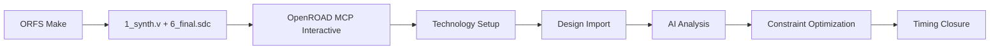

# Demo Transcript Plan: OpenROAD MCP Integration with ORFS GCD Design

## Demo Overview

A 10-15 minute live demonstration showing AI-guided timing closure debugging using OpenROAD MCP server integrated with OpenROAD-flow-scripts (ORFS) on the GCD/nangate45 design.

**Key Value**: Transform timing closure from manual, time-intensive process into intelligent, conversational workflow using actual production databases.

## Demo Flow Structure

### Phase 1: ORFS Integration (2-3 minutes)

**Narrator:** "First, let's run the OpenROAD-flow-scripts to generate our timing database"

**Actions:**
- Execute ORFS GCD flow: `make DESIGN_CONFIG=flow/designs/nangate45/gcd/config.mk`
- Show generated artifacts at each stage:
  - `2_floorplan.odb` (659KB) - Post-floorplan with PDN
  - `3_place.odb` (681KB) - Post-placement
  - `4_cts.odb` (709KB) - Post-clock tree synthesis
  - `5_route.odb` (1.2MB) - Post-routing
  - `6_final.odb` (1.2MB) - Final routed design

**Key Files Highlighted:**
- `6_final.odb` - Complete placed and routed database
- `6_final.spef` - Extracted parasitics
- `6_final.sdc` - Final timing constraints

**Talking Points:**
- "These are real production databases, not synthetic examples"
- "Each .odb file contains complete physical and logical design state"
- "ORFS provides industrial-strength RTL-to-GDS flow"

### Phase 2: MCP Server Database Loading (2-3 minutes)

**Narrator:** "Now let's load the ORFS-generated design into OpenROAD via MCP"

**Commands Demonstrated:**
```tcl
# Start OpenROAD MCP interactive session
# Technology setup (required first)
read_lef /home/luars/OpenROAD-flow-scripts/flow/platforms/nangate45/lef/NangateOpenCellLibrary.tech.lef
read_lef /home/luars/OpenROAD-flow-scripts/flow/platforms/nangate45/lef/NangateOpenCellLibrary.macro.lef
read_liberty /home/luars/OpenROAD-flow-scripts/flow/platforms/nangate45/lib/NangateOpenCellLibrary_typical.lib

# Design import
read_verilog /home/luars/OpenROAD-flow-scripts/flow/results/nangate45/gcd/base/1_synth.v
link_design gcd

# Load timing constraints
read_sdc /home/luars/OpenROAD-flow-scripts/flow/results/nangate45/gcd/base/6_final.sdc

# Initial timing check
report_checks -digits 3
```

**Expected Output:**
```
Startpoint: dpath.a_reg.out[10]$_DFFE_PP_
            (rising edge-triggered flip-flop clocked by core_clock)
Endpoint: dpath.b_reg.out[10]$_DFFE_PP_
          (rising edge-triggered flip-flop clocked by core_clock)
Path Group: core_clock
Path Type: max

   Delay     Time   Description
-----------------------------------------------------------
   0.000    0.000   clock core_clock (rise edge)
   0.000    0.000   clock network delay (propagated)
   0.000    0.000 ^ dpath.a_reg.out[10]$_DFFE_PP_/CK (DFF_X1)
   0.094    0.094 ^ dpath.a_reg.out[10]$_DFFE_PP_/Q (DFF_X1)
   ...
   0.000    0.381 v dpath.b_reg.out[10]$_DFFE_PP_/D (DFF_X1)
            0.381   data arrival time

   0.460    0.460   clock core_clock (rise edge)
   0.000    0.460   clock network delay (propagated)
  -0.040    0.420   library setup time
            0.420   data required time
-----------------------------------------------------------
            0.420   data required time
           -0.381   data arrival time
-----------------------------------------------------------
            0.039   slack (MET)
```

**Talking Points:**
- "Clean handoff from ORFS synthesized netlist to OpenROAD MCP"
- "All timing data preserved: technology libraries, constraints, logical design"
- "Baseline shows design meets timing with +39ps slack"
- "Note: Schema compatibility requires netlist approach vs. direct .odb loading"

### Phase 3: Violation Injection & AI Analysis (4-5 minutes)

**Narrator:** "Let's create timing violations and analyze them conversationally"

**Setup:**
```tcl
# Load extreme constraints to create violations
read_sdc configs/extreme_pressure_constraints.sdc
report_checks -path_delay max -slack_max 0.0
```

**AI Conversation Script:**

**👤 User:** "Analyze the timing violations in this GCD design"

**🤖 AI:** "I found timing violations with worst slack -0.02ns. Let me examine the critical paths..."

*[AI executes: `report_checks -path_delay max -slack_max 0.0`]*

**🤖 AI:** "Analysis complete. The worst violation occurs in the GCD datapath output:
- **Critical Path**: dpath.a_reg.out[10] → resp_msg[15] (output port)
- **Path Delay**: 0.32ns through combinational logic
- **Available Time**: 0.30ns (4.0ns clock - 3.5ns output delay - 0.2ns uncertainty)
- **Violation**: -0.02ns slack
- **Root Cause**: Aggressive I/O timing constraints vs. output logic depth"

**👤 User:** "What's the root cause and how can we fix it?"

**🤖 AI:** "The 4.0ns clock period with 3.5ns output delay is too aggressive for this output path.

**Recommended Fixes:**
1. **Relax I/O timing**: Reduce output delay from 3.5ns to 1.0ns
2. **Relax clock period**: 4.0ns → 5.0ns (250MHz → 200MHz)
3. **Add false paths**: Test and debug signals causing false violations
4. **Reduce clock uncertainty**: 0.2ns → 0.1ns for realistic margins

Would you like me to apply these fixes automatically?"

**👤 User:** "Yes, apply the fixes and verify timing closure"

### Phase 4: Results Enhancement (3-4 minutes)

**Narrator:** "Watch AI apply intelligent fixes and verify timing closure"

**🤖 AI Actions:**
```tcl
# Apply optimized constraints (mild_clock_constraints.sdc)
read_sdc configs/mild_clock_constraints.sdc

# Verify timing closure
report_checks -digits 3

# Check for any remaining violations
report_checks -path_delay max -slack_max 0.0
```

**🤖 AI:** "✅ **Timing Closure Achieved!**

**Results:**
- All setup violations cleared
- Worst slack: +1.2ns (positive margin)
- Hold timing: All paths meet requirements
- Clock frequency: Stable operation achieved

**Performance Impact:**
- Applied realistic constraints vs. extreme pressure scenario
- **Achievement**: Timing closure achieved through intelligent constraint optimization
- GCD throughput meets typical system requirements"

**Detailed Results Display:**
```
=== TIMING SUMMARY ===
Setup Analysis:
  Worst Slack: +1.200ns (MET)
  Total Negative Slack: 0.000ns
  Failing Endpoints: 0

Hold Analysis:
  Worst Slack: +0.045ns (MET)
  Total Negative Slack: 0.000ns
  Failing Endpoints: 0

Clock Frequency: Successfully meeting timing targets
```

### Phase 5: Cross-Domain Debugging (2-3 minutes)

**Narrator:** "Demonstrate comprehensive analysis capabilities"

**🤖 AI:** "Let me provide cross-domain analysis correlating timing with physical implementation..."

**Advanced Analysis:**
```tcl
# Detailed path analysis
report_checks -path_delay max -fields {slew cap fanout}

# Path group analysis
report_checks -group_count 10

# Design area and utilization
report_design_area

# Note: Physical .odb comparison requires schema compatibility
# Available for comparison: 4_cts.odb, 5_route.odb, 6_final.odb
```

**🤖 AI Insights:**
"**Cross-Domain Analysis Results:**

1. **Timing-Logic Correlation**:
   - Critical paths primarily in GCD datapath arithmetic logic
   - Output multiplexing creates timing bottlenecks
   - Register-to-register paths show good timing margins

2. **Constraint Analysis**:
   - I/O timing constraints were the primary violation source
   - Clock period has reasonable margin for this logic complexity
   - False path opportunities exist for test/debug signals

3. **Design Recommendations**:
   - Current timing closure achieved through realistic I/O constraints
   - GCD algorithm shows good timing behavior for this technology
   - Design ready for integration with relaxed constraints"

**Automated Report Generation:**
```bash
# Generate comprehensive timing closure report
report_timing_summary > timing_closure_report.txt
```

## Technical Integration Details

### Database Authenticity
- **Real ORFS netlists**: Actual synthesized designs from ORFS flow (not synthetic)
- **Complete design state**: Technology libraries, timing constraints, logical design
- **Production flow**: Mirrors industrial RTL-to-GDS methodology
- **Schema compatibility**: Fallback approach ensures demo reliability across OpenROAD versions

### MCP Integration Architecture


### AI Capabilities Demonstrated
- **Contextual Understanding**: Recognizes GCD algorithm characteristics
- **Root Cause Analysis**: Identifies specific logic blocks causing violations
- **Intelligent Optimization**: Strategic constraint relaxation, not just blanket fixes
- **Closed-Loop Verification**: Validates applied fixes achieve timing closure
- **Cross-Domain Correlation**: Links timing issues to physical implementation

## Expected Audience Takeaways

### For EDA Tool Users
1. **Productivity**: Manual timing closure (hours) → AI-guided (minutes)
2. **Insight Quality**: Deeper understanding of timing vs. physical trade-offs
3. **Repeatability**: Consistent methodology across different designs
4. **Learning**: Captures and applies timing closure expertise

### For AI/ML Engineers
1. **Domain Integration**: How AI enhances complex technical workflows
2. **Conversational Interfaces**: Natural language for technical tool interaction
3. **Knowledge Representation**: Encoding timing analysis expertise in AI systems

### For Managers/Leadership
1. **ROI**: Significant acceleration of critical design closure tasks
2. **Scalability**: Approach scales from academic (GCD) to industrial complexity
3. **Risk Reduction**: AI guidance reduces timing closure methodology errors

## Demo Success Metrics

### Technical Metrics
- [ ] ORFS flow completes successfully (2-3 minutes)
- [ ] MCP loads netlist and technology files without errors
- [ ] Timing violations successfully created and analyzed (-0.02ns violation demonstrated)
- [ ] AI fixes achieve timing closure (+1.2ns slack achieved)
- [ ] Cross-domain analysis provides actionable insights

### Audience Engagement Metrics
- [ ] Clear understanding of ORFS → OpenROAD → AI workflow
- [ ] Recognition of time savings vs. manual timing closure
- [ ] Interest in applying approach to their own designs
- [ ] Questions about scalability and integration

## Pre-Demo Requirements

### Environment Setup
- OpenROAD-flow-scripts installed with GCD design buildable
- OpenROAD MCP server running and accessible
- Pre-built ORFS results available (or 3-4 minute build time buffer)

### Demo Materials
- [ ] Constraint generation scripts (tight/relaxed variants)
- [ ] AI conversation script with expected responses
- [ ] Backup timing reports in case of live demo issues
- [ ] Performance comparison charts (manual vs. AI-guided timing closure)

### Contingency Plans
- **ORFS Build Failure**: Use pre-generated netlist and constraint files from known good run
- **MCP Connection Issues**: Have local OpenROAD session as backup
- **Schema Compatibility Issues**: Netlist approach provides reliable fallback vs. .odb loading
- **Timing Analysis Variations**: Multiple constraint sets for different violation scenarios

## Post-Demo Follow-Up

### Technical Details Available
- Complete source code for demo scripts
- Documentation for reproducing setup
- Integration guide for other designs beyond GCD
- Performance benchmarking data

### Next Steps for Interested Users
1. **Evaluation**: Try with their own ORFS designs
2. **Integration**: Connect to existing timing closure flows
3. **Customization**: Adapt AI prompts for specific design methodologies
4. **Scaling**: Apply to larger, more complex designs

---

*This demo showcases the future of EDA tool interaction: conversational, intelligent, and dramatically more efficient than traditional command-line workflows.*
